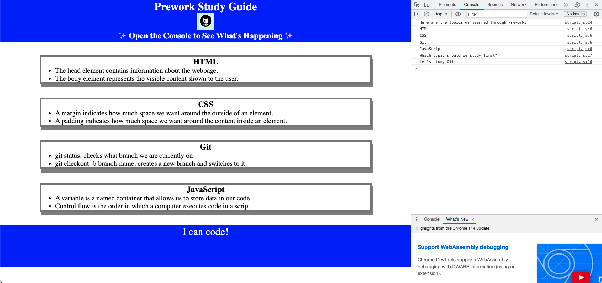

# Prework Study Guide Webpage

## Description

- My motivaton for creating this study guide webpage was an eagerness to learn and apply some of teh basic fundamentals in coding. 
- I built this project to document and reference what I learned in the prework preparation for this course.
- This project allowed familiarity and hands on application with the tools, language, and syntax of Git, HTML, CSS< and JavaScript.
- I learned that I have been exposed to many of the concepts demonstrated in the prework, without actually knowing the 'why' and fundamental building blocks.

## Installation

N/A

## Usage

To use this Prework Study Guide, you can review the notes in each section. For suggestions on what to study first, open the Chrome DevTools by pressing Command+Option+I (macOS) or Control+Shift+I (Windows). A console panel should open either below or to the side of the webpage in the browser. There you will see a list of topics we learned from the prework along with a suggestion on which topic to study first.

To add a screenshot, create an `assets/images` folder in your repository and upload your screenshot to it. Then, using the relative file path, add it to your README using the following syntax:

## License

The last section of a high-quality README file is the license. This lets other developers know what they can and cannot do with your project. If you need help choosing a license, refer to [https://choosealicense.com/](https://choosealicense.com/).